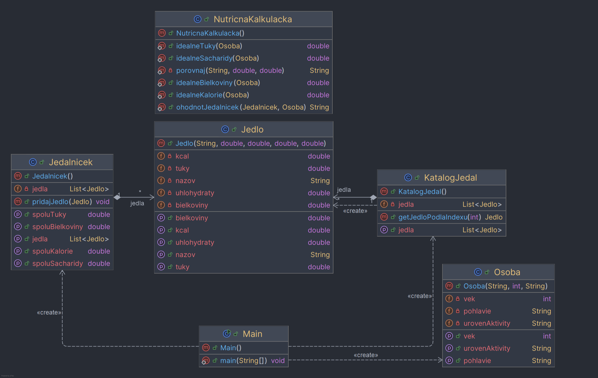

# Nutričná kalkulačka 🍽️
**Školský tímový projekt – Objektové programovanie**

Konzolová Java aplikácia, ktorá umožňuje používateľovi zostaviť si denný jedálniček,
vypočítať príjem kalórií a makronutrientov a ohodnotiť jeho vhodnosť
podľa ideálneho denného príjmu pre konkrétnu osobu
(pohlavie, vek, úroveň fyzickej aktivity).
---
## Autori
### 2. skupina – 3.SB
- **Marek Kostilník**
- **Filip Lohyňa**
- **Dominik Straka**
---
## Popis programu
Program pracuje s objektami tried **Osoba**, **Jedlo**, **Jedálniček** a **NutričnáKalkulačka**.
Používateľ si po zadaní základných údajov o osobe vyberá jedlá z preddefinovaného katalógu,
zostavuje denný jedálniček a následne je tento jedálniček vyhodnotený
na základe odporúčaného denného kalorického príjmu.
---
## Ovládanie programu
### Zadanie údajov o osobe
Po spustení programu je používateľ vyzvaný na zadanie:
- **Pohlavia** (`muz` / `zena`)
- **Veku** (celé číslo)
- **Úrovne aktivity** (`nizka`, `stredna`, `vysoka`)

### Potom sa zobrazí hlavné menu: 
* --------- MENU -----------
* 1 Zobraziť katalóg jedál
* 2 Pridať jedlo do jedálnička
* 3 Zobraziť denný príjem
* 4 Ohodnotiť jedálniček
* 0 Koniec
---
## Preddefinované jedlá v katalógu
Nasledujúce jedlá sú automaticky načítané pri spustení programu:

| Jedlo                 | Kalorie | Bielkoviny (g) | Tuky (g) | Sacharidy (g) |
|-----------------------|---------|----------------|----------|---------------|
| Kuracie prsia         | 165     | 31             | 3.6      | 0             |
| Hovädzie mäso chudé   | 250     | 26             | 17       | 0             |
| Losos pečený          | 206     | 22             | 13       | 0             |
| Vajce Varené          | 70      | 6.3            | 4.75     | 0.35          |
| Ryža biela varená     | 130     | 2.7            | 0.3      | 28            |
| Zemiaky varené        | 77      | 2              | 0.1      | 17            |
| Ovsené vločky (suché) | 379     | 13             | 7        | 66            |
| Celozrnný chlieb      | 247     | 9              | 3.4      | 49            |
| Jablko                | 52      | 0.3            | 0.2      | 14            |
| Banán                 | 89      | 1.1            | 0.3      | 23            |
| Brokolica varená      | 35      | 2.4            | 0.4      | 7             |
| Mrkva surová          | 41      | 0.9            | 0.2      | 10            |
| Tvaroh odtučnený      | 71      | 16.5           | 0.2      | 1.3           |
___

## Vyhodnotenie jedálnička
Jedálniček je vyhodnotený na základe porovnania:
- celkového kalorického príjmu,
- ideálneho denného príjmu vypočítaného podľa pohlavia a úrovne aktivity.

Výsledok môže byť:
- **Nedostatočný kalorický príjem**
- **Vyhovujúci jedálniček**
- **Nadmerný kalorický príjem**
---
## UML Diagram

---
## Flowchart vyhodnotenia jedálnička
```mermaid
flowchart TD
    A[Začiatok] --> B{Zadané údaje o osobe?}
    B -->|Nie| C[Chyba vstupu]
    B -->|Áno| D{Jedálniček prázdny?}
    D -->|Áno| E[Jedálniček je prázdny]
    D -->|Nie| F[Vypočítať prijaté kalórie]
    F --> G[Vypočítať ideálne kalórie]
    G --> H{Porovnanie}
    H -->|< 90 %| I[Nedostatočný príjem]
    H -->|90–110 %| J[Vyhovujúci jedálniček]
    H -->|> 110 %| K[Nadmerný príjem]
    I --> L[Koniec]
    J --> L
    K --> L