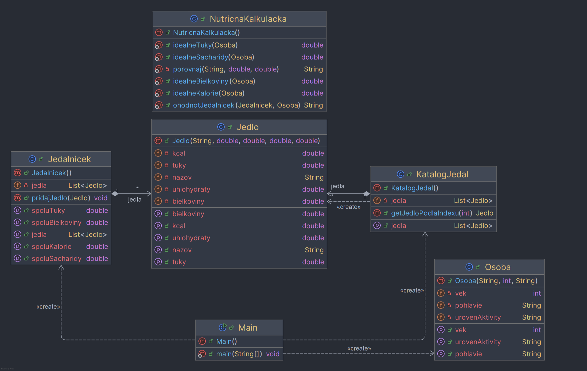
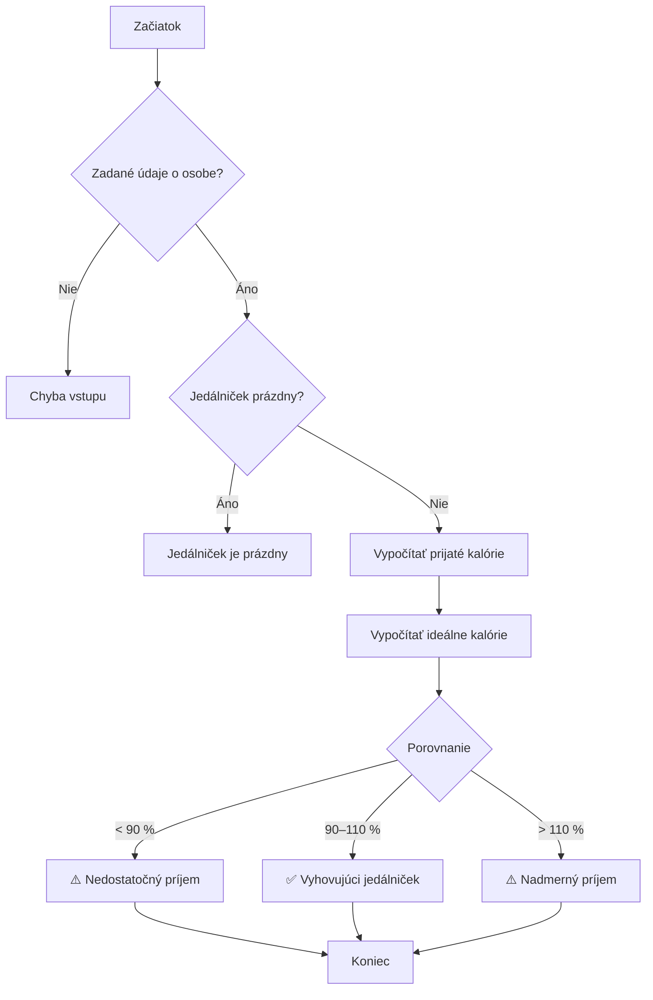

# 🍽️ Nutričná kalkulačka

> Konzolová Java aplikácia na zostavovanie denného jedálnička s výpočtom kalórií a makronutrientov.

**Školský tímový projekt – Objektové programovanie | 2. skupina – 3.SB**

| Autor | Autor | Autor |
|---|---|---|
| Marek Kostilník | Filip Lohyňa | Dominik Straka |

---

## Obsah

- [Popis programu](#popis-programu)
- [Ovládanie](#ovládanie)
- [Katalóg jedál](#katalóg-jedál)
- [Vyhodnotenie jedálnička](#vyhodnotenie-jedálnička)
- [UML diagram](#uml-diagram)
- [Flowchart](#flowchart)

---

## Popis programu

Program pracuje so štyrmi triedami:

| Trieda | Popis |
|---|---|
| `Osoba` | Uchováva pohlavie, vek a úroveň aktivity |
| `Jedlo` | Reprezentuje jedlo s nutričnými hodnotami |
| `Jedálniček` | Zoznam zjedených jedál počas dňa |
| `NutričnáKalkulačka` | Hlavná logika – výpočty a vyhodnotenie |

Po zadaní údajov o osobe si používateľ vyberá jedlá z preddefinovaného katalógu, zostavuje denný jedálniček a program ho vyhodnotí na základe odporúčaného kalorického príjmu.

---

## Ovládanie

### 1. Spustenie – zadanie údajov o osobe

Program si pri štarte vyžiada:

- **Pohlavie** – `muz` alebo `zena`
- **Vek** – celé číslo
- **Úroveň aktivity** – `nizka`, `stredna` alebo `vysoka`

### 2. Hlavné menu

```
--------- MENU -----------
1  Zobraziť katalóg jedál
2  Pridať jedlo do jedálnička
3  Zobraziť denný príjem
4  Ohodnotiť jedálniček
0  Koniec
```

---

## Katalóg jedál

Nasledujúce jedlá sú automaticky načítané pri spustení programu (hodnoty na 100 g):

| Jedlo | Kalórie (kcal) | Bielkoviny (g) | Tuky (g) | Sacharidy (g) |
|---|---:|---:|---:|---:|
| Kuracie prsia | 165 | 31,0 | 3,6 | 0,0 |
| Hovädzie mäso chudé | 250 | 26,0 | 17,0 | 0,0 |
| Losos pečený | 206 | 22,0 | 13,0 | 0,0 |
| Vajce varené | 70 | 6,3 | 4,75 | 0,35 |
| Ryža biela varená | 130 | 2,7 | 0,3 | 28,0 |
| Zemiaky varené | 77 | 2,0 | 0,1 | 17,0 |
| Ovsené vločky (suché) | 379 | 13,0 | 7,0 | 66,0 |
| Celozrnný chlieb | 247 | 9,0 | 3,4 | 49,0 |
| Jablko | 52 | 0,3 | 0,2 | 14,0 |
| Banán | 89 | 1,1 | 0,3 | 23,0 |
| Brokolica varená | 35 | 2,4 | 0,4 | 7,0 |
| Mrkva surová | 41 | 0,9 | 0,2 | 10,0 |
| Tvaroh odtučnený | 71 | 16,5 | 0,2 | 1,3 |

---

## Vyhodnotenie jedálnička

Jedálniček je vyhodnotený porovnaním skutočného a ideálneho kalorického príjmu (vypočítaného podľa pohlavia, veku a úrovne aktivity):

| Výsledok | Podmienka |
|---|---|
| ⚠️ Nedostatočný kalorický príjem | < 90 % ideálneho príjmu |
| ✅ Vyhovujúci jedálniček | 90 % – 110 % ideálneho príjmu |
| ⚠️ Nadmerný kalorický príjem | > 110 % ideálneho príjmu |

---

## UML diagram



---

## Flowchart


```mermaid
flowchart TD
    A[Začiatok] --> B{Zadané údaje o osobe?}
    B -->|Nie| C[Chyba vstupu]
    B -->|Áno| D{Jedálniček prázdny?}
    D -->|Áno| E[Jedálniček je prázdny]
    D -->|Nie| F[Vypočítať prijaté kalórie]
    F --> G[Vypočítať ideálne kalórie]
    G --> H{Porovnanie}
    H -->|< 90 %| I[⚠️ Nedostatočný príjem]
    H -->|90–110 %| J[✅ Vyhovujúci jedálniček]
    H -->|> 110 %| K[⚠️ Nadmerný príjem]
    I --> L[Koniec]
    J --> L
    K --> L
```